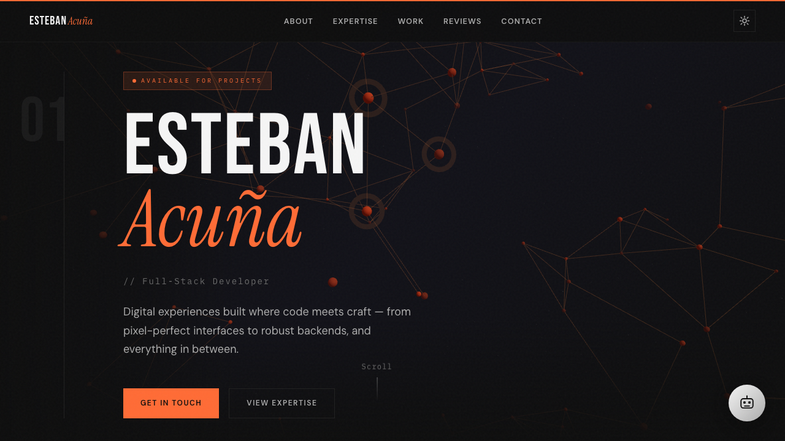

<h1 align="center">Esteban Acuña — Portfolio</h1>

<p align="center">My personal portfolio: a full-stack Next.js site where interactive 3D, smooth motion, and an AI chat assistant come together. Built where code meets craft.</p>

<p align="center">
  <a href="https://estebanacuna.dev"></a>
</p>

<p align="center">
  
</p>

<p align="center">
  
  
  
  
  
  
</p>

## Highlights

- 🎨 **Interactive 3D** — React Three Fiber + drei scenes in the hero and "solver" sections
- 🤖 **AI chat assistant** — a built-in chat widget backed by the Claude API (`/api/chat`) that can answer questions about me and my work
- 🌀 **Buttery-smooth motion** — Lenis smooth scrolling paired with GSAP-driven animations and a polished page loader
- 🌗 **Light / dark themes** with `next-themes`
- 🧩 **Section-based architecture** — Hero, Expertise, Work, Reviews, Contact, plus dedicated work case-study pages
- 🥚 A little dev easter egg, because why not

## Tech stack

**Framework:** Next.js (App Router) · TypeScript
**3D / motion:** React Three Fiber · drei · Three.js · GSAP · Lenis
**Styling:** Tailwind CSS
**AI:** Anthropic Claude API
**Deploy:** Vercel

## Run locally

```bash
npm install
npm run dev      # http://localhost:3000
```

To enable the AI chat locally, add your Anthropic key to `.env.local`:

```bash
ANTHROPIC_API_KEY=your_key_here
```

```bash
npm run build    # production build
npm run start    # serve the production build
```

---

<p align="center"><i>Made by Esteban Acuña · <a href="https://estebanacuna.dev">estebanacuna.dev</a> · <a href="https://www.linkedin.com/in/esteban-acu%C3%B1a/">LinkedIn</a></i></p>
